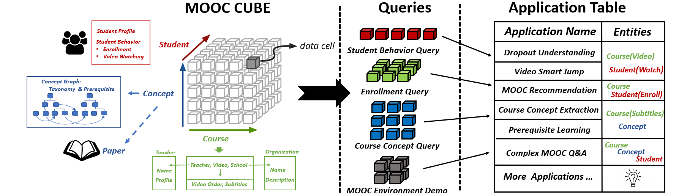
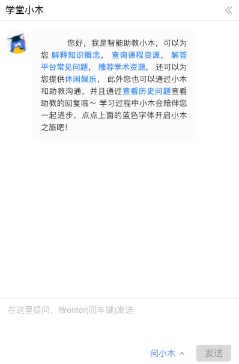

# MOOCCube ver1.0

本页面所发布的数据集是ACL2020的论文 __"MOOCCube: A Large-scale Data Repository for NLP applications in MOOCs"__([PDF]())中所介绍的。 更多细节可以参考论文描述。

This is the dataset introduced in ACL2020 Paper __"MOOCCube: A Large-scale Data Repository for NLP applications in MOOCs"__([PDF]()). You can find more details through the descriptions in our paper.

## 什么是MOOCCube? / What is MOOCCube?

MOOCCube是面向大规模在线教育有关的自然语言处理、知识图谱、数据挖掘等研究者的开放数据仓库，包含706门真实在线课程、38,181个教学视频、106,056个概念，46,075名MOOC用户的数十万选课、视频观看记录，一个由概念间的先后修，上下位等关系的概念图谱以及包含数十万篇与课内概念有关的学术论文资源的补充资源库。

其概念术语以及实体的描述数据来源于[百度百科](https://baike.baidu.com/)，[维基百科](https://www.wikipedia.org/)，和[术语在线](http://www.termonline.cn/), 课程数据和学生行为数据来自于 [学堂在线](https://xuetangx.com/)的真实使用环境。学术论文数据来自于大规模学术搜索引擎[Aminer](https://www.aminer.cn/)。这些数据经过自动化筛选、众包标注以及专家标注三个阶段，最终组成了MOOCCube数据仓库。

* * *

MOOCCube is an open data repository for natural language processing, knowledge graphs, data mining and other researchers who are interested in massive open online courses(MOOCs). It contains 706 MOOC courses, 38,181 videos, 106,056 concepts, and 46,075 real MOOC users. This data source also contains a large-scale Concept Graph and related academic papers as additional resources for further utilization.

The information of our concept graph is extracted from [Baidubaike](https://baike.baidu.com/), [Wikipeida](https://www.wikipedia.org/) and [Termonline](http://www.termonline.cn/). The data of courses and student activities are  from the real environment of [XuetangX](https://xuetangx.com/), one of the largest MOOC website in China. The academic resourses are provided by [Aminer](https://www.aminer.cn/), an academic project which provides comprehensive search and mining services for researcher social networks.

## 数据组成和下载 / Data Composition and Download

MOOCCube包含主仓库[MOOCCube](http://lfs.aminer.cn/misc/moocdata/data/mooc_cube.zip)和单独课程仓库[MOOCCube_DS]()两部分:

* 单独课程仓库: MOOCCube_DS是根据"数据结构"课程的实际教学需要，精细化标注的MOOCCube的特殊组成部分，其包含的信息比主仓库的课程维度更多，但是数据量较少，目前本项目仍在更新中，请继续关注！
* 主仓库：论文中描述的MOOCCube数据仓库，以概念、课程、学生行为作为三个主要维度，支持多种数据组合方式，用以支持不同的教学研究需要，其架构图和数据描述如下所示：

MOOCCube contains two parts: main repository and special course repository:

* Special Course Repository: MOOCCube_DS is a special component of the MOOCCube, which is refined and annotated according to the actual teaching needs of the "data structure" course. It contains more information than the main repository. Please stay tuned!
* Main Repository: The MOOCCube data repository described in the paper, which takes concepts, courses, and student behavior as the three main dimensions, and provides multiple data combination methods to support different teaching and research needs.

### 实体 / Entities

MOOCCube数据集包含以下实体类型：

MOOCCube dataset contains these types of entities:

| type     | prefix of id | important fields                                        | file         |
| -------- | ------------ | ------------------------------------------------------- | ------------ |
| concept  | K_           | name, en, explanation                                   | concept.json |
| course   | C_           | name, about, core_id, video_order, video_name, chapter  | course.json  |
| paper    | P_           | title, author, venue, abstract, year, num_citation, ... | paper.json   |
| school   | S_           | name, about                                             | school.json  |
| teacher  | T_           | name, about                                             | teacher.json |
| user     | U_           | name, course_order, enroll_time                         | user.json    |
| video    | V_           | name, duration, start, end, text                        | video.json   |
| taxonomy | K_T_         | name                                                    | concept.json |

两门课程的core_id相同说明它们的video集合有交集，user的name字段是随机生成的名字。

Two courses will have same core_id if their video sets intersect.

Name field of user entities is randomly generated.

### 关系 / Relations

- concept-field
- concept-paper
- course-concept
- course-video
- parent-son (taxonomy)
- prerequisite-dependency
- school-course
- school-teacher
- teacher-course
- user-course
- user-video
- video-concept

### 补充文件 / Additional information

- concept_information: more text data of each concept.

- user_video_act: filtered watching video behavior of users.

- prerequisite_prediction: more prerequisite relations generated by a GCN classifier.

## MOOCCube应用 / The applications of MOOCCube

MOOCCube中的数据可以支持多种与MOOC有关的研究，包括:

* **课程推荐**
* **学生行为预测**
* **课程概念抽取**
* **先后修关系抽取**
* ...

更多相关的研究都可以在我们的团队主页上发现: [http://moocdata.cn](http://moocdata.cn/publications)

* * *

MOOCCube can provide datasets to support multiple research topics related to MOOC, including:

* **Course Recommendation**
* **Student Performance Prediction**
* **Course Concept Extraction**
* **Prerequisite Relation Learning**
* ...

You can find more interesting topics in our team page: [http://moocdata.cn](http://moocdata.cn/publications)

### 学堂小木 / Xiaomu

小木是一个挂载于学堂在线MOOC主站上的智能机器人，提供课程答疑、主动提问等教学辅助功能，其后台知识库的知识概念部分即主要由MOOCCube提供。

Xiaomu is an intelligent robot mounted on the XuetangX main station, providing teaching auxiliary functions such as course question answering and active questioning. The knowledge concept part of its background knowledge base is mainly provided by MOOCCube.

## 关于我们 / About us

We are THU MOOC team, whose members are at Knowledge Engineering Group of Tsinghua Univerisity. We are committed to helping you solve the intellectual problem of education and create a better online education environment.
